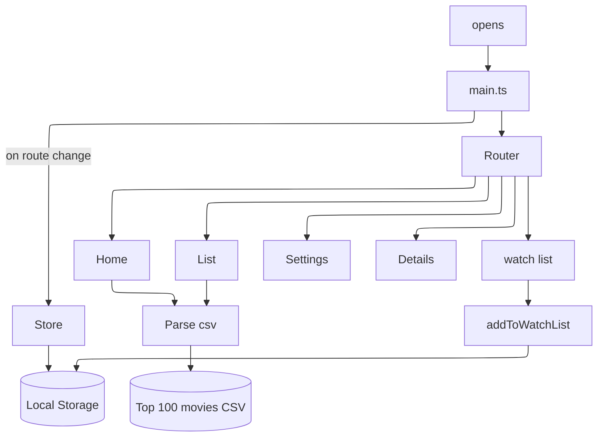

# Basic module diagram

```mermaid

---
config:
   layout: elk
---
flowchart TB

opens --> main[main.ts]
main --> Router
main -->|on route change|Store
Store -->L[(Local Storage)]
Router --> Home  & MovieList[List] & Settings & Details & List["watch list"]
MovieList --> parseCSV["Parse csv"]
Home --> parseCSV
parseCSV -->csv[("Top 100 movies CSV")]
List --> addToWatchList
addToWatchList --> L

```
